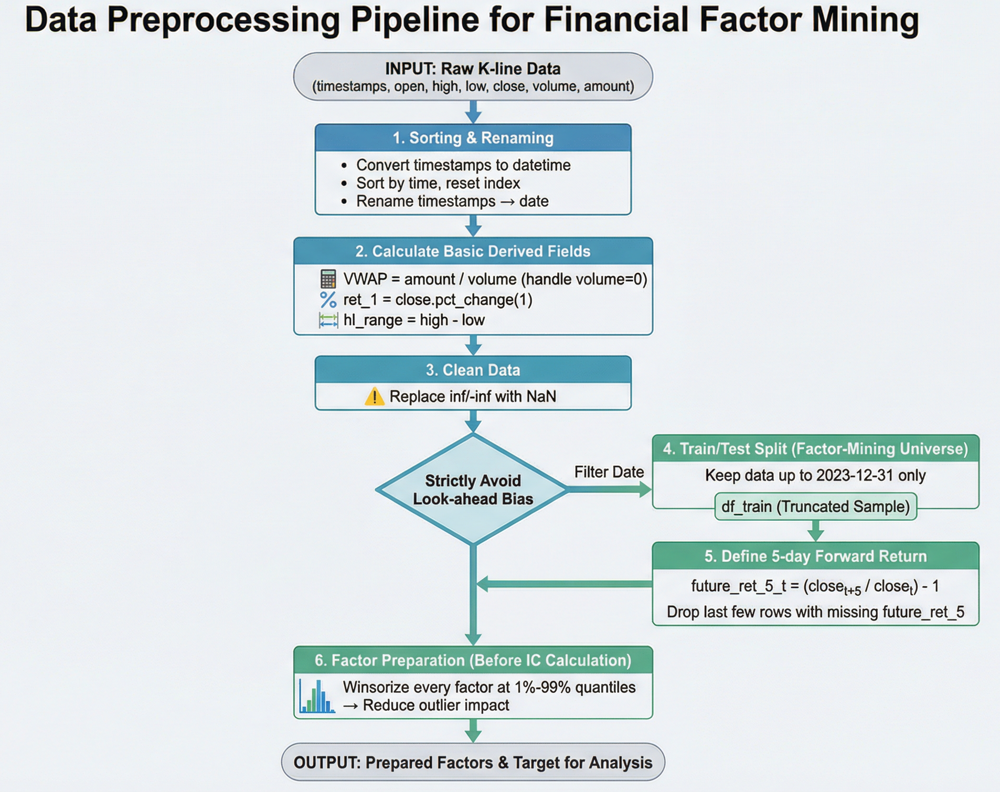

# Machine Learning: Quantitative Trading of a single stock with a small sample size

**The project web can be found [here](https://scutxyx.github.io/SCUTMLTrading.github.io/)**

This project is aimed at building a Machine Learning model to implement quantitative trading on the Tencent Stock based on ¥100000. Specifically , we build a model to satisfy the following requirements:

* Complete preprocessing of the provided data and mine relevant factors.
* Construct a machine learning model, build a training dataset, predict stock prices, and analyze the prediction effectiveness.
* Based on the stock prices predicted by machine learning, identify buying and selling opportunities, develop a trading strategy, and achieve index enhancement to capture excess returns (alpha).
* The strategy must aim to keep the maximum drawdown as low as possible.
* Create visualizations of the final investment results, evaluate the results against actual market data, and conduct a comprehensive assessment of the strategy's and model's overall effectiveness.

## FrameWork


## Quick Start

### Requirements Install


```shell
conda create -n mlhw python=3.12 -y
conda activate mlhw
pip install -r requirements.txt
```

### $\alpha$ Factor Mining



#### Factor Minining

| 类别            | 因子名称          | 计算公式/描述                               |
| --------------- | ----------------- | ------------------------------------------- |
| **动量因子**    | `ret_1`           | 1日收益率                                   |
|                 | `ret_5`           | 5日收益率                                   |
|                 | `ret_10`          | 10日收益率                                  |
|                 | `ret_20`          | 20日收益率                                  |
|                 | `ma_5`            | 5日移动平均线                               |
|                 | `ma_20`           | 20日移动平均线                              |
|                 | `ma_5_20_diff`    | 5日与20日移动平均线差值：`ma_5 - ma_20`     |
|                 | `ma_slope`        | 移动平均线斜率：`ma_5.diff()`               |
|                 | `rsi_14`          | 14日相对强弱指数（自主实现，不使用TA-Lib）  |
|                 | `macd_dif`        | MACD差值（DIF）                             |
|                 | `macd_dea`        | MACD信号线（DEA）                           |
|                 | `macd`            | MACD柱状图                                  |
| **波动率因子**  | `volatility_10`   | 10日收益率波动率（基于`ret_1`的滚动标准差） |
|                 | `volatility_20`   | 20日收益率波动率（基于`ret_1`的滚动标准差） |
|                 | `hl_vol`          | 高低波动率：`hl_range / close`              |
| **价量因子**    | `vol_roc_5`       | 5日成交量变化率：`volume.pct_change(5)`     |
|                 | `price_vwap_diff` | VWAP偏离度：`close / vwap - 1`              |
|                 | `obv`             | 能量潮指标：`cumsum(sign(ret_1) * volume)`  |
| **K线结构因子** | `body`            | K线实体长度：`abs(close - open)`            |
|                 | `upper_shadow`    | 上影线长度                                  |
|                 | `lower_shadow`    | 下影线长度                                  |
|                 | `body_ratio`      | 实体比例：`body / hl_range`                 |
|                 | `upper_ratio`     | 上影线比例：`upper_shadow / hl_range`       |
|                 | `lower_ratio`     | 下影线比例：`lower_shadow / hl_range`       |

#### Execution (scripts)

All scripts are located under `alpha_factor/script/`. Run them **from the project root** so that relative paths work:

```bash
cd Machine-Learning-2025Fall
```

1. **Factor mining & IC ranking**

   ```bash
   python alpha_factor/script/alpha_factor_mining.py
   ```

   - Input: `data/data.csv`
   - Output:
     - `alpha_factor/output/alpha_factor_ic_ranking.csv` — full IC table and ranking

2. **IC ranking visualization**

   ```bash
   python alpha_factor/script/plot_factor_rank.py
   ```

   - Input: `alpha_factor/output/alpha_factor_ic_ranking.csv`
   - Output (in `alpha_factor/output/`):
     - `top_factors_by_abs_rank_ic.png/.pdf` — horizontal bar plot of |Rank IC|
     - `pearson_vs_spearman_ic.png/.pdf` — side‑by‑side Pearson vs Spearman IC

3. **Factor report (layered returns & rolling IC)**

   ```bash
   python alpha_factor/script/factor_report.py
   ```

   - Input: `data/data.csv`
   - Output (in `alpha_factor/output/factor_report_plots/`), for each selected factor:
     - `<factor>_longshort.png/.pdf` — long‑short cumulative return by factor quantiles
     - `<factor>_ic_timeseries.png/.pdf` — 120‑day rolling Spearman IC time series


### Model Building and Preprocessing 

#### Prepare Data

Ensure your data file is located at `data/data.csv` with the following columns:

- `timestamps`: Timestamp (date format)
- `open`: Opening price
- `high`: Highest price
- `low`: Lowest price
- `close`: Closing price
- `volume`: Trading volume
- `amount`: Trading amount


#### Model Training

##### Train XGBoost with Default Configuration

```bash
cd ml_model/model
python train_xgboost.py
```

##### Train with Custom Parameters

```bash
python train_xgboost.py horizon=1 lookback=10 data.data_path=data/your_data.csv data.train=[2018-01-02,2023-12-31] model.kwargs.max_depth=10
```

#### Training Different Models

Choose the model you want to train(LSTM,GRU,Xgboost,RandomForest)

```bash
cd ml_model/model

# XGBoost
python train_{model}.py
```

#### ⚙Configuration

All configuration files are located in `ml_model/config/` directory and use YAML format:

```yaml
data:
  data_path: data/data.csv          # Data file path
  fit_start_time: 2018-01-02        # Feature fitting start time
  fit_end_time: 2023-01-01         # Feature fitting end time
  train: [2018-01-02, 2023-01-03]  # Training set time range
  valid: [2023-01-04, 2023-12-29]  # Validation set time range
  test: [2024-01-02, 2025-04-24]   # Test set time range

model:
  model_name: xgboost
  kwargs:
    # Model-specific hyperparameters
    max_depth: 8
    n_estimators: 647
    learning_rate: 0.421
    # ...

output_dir: ml_model/output/xgboost
checkpoints_output_dir: ml_model/checkpoints/xgboost

horizon: 5      # Forecast horizon (days ahead to predict)
lookback: 30    # Lookback window (days of history to use as input)
```

#### 📊 Output

After training, all results are saved in `ml_model/output/<model_name>/horizon_<horizon>/` directory:

#### Model Saving

Trained models are saved in `ml_model/checkpoints/<model_name>/horizon_<horizon>/` directory:

- **XGBoost/LightGBM/Random Forest**: `*.pkl` (pickle format)
- **LSTM/GRU**: `*.pth` (PyTorch format) + `scaler_X.pkl`, `scaler_y.pkl` (scalers)

#### 📁 Project Structure

```
ml_model/
├── config/                 # Configuration files directory
│   ├── xgboost.yaml
│   ├── lightGBM.yaml
│   ├── random_forest.yaml
│   ├── lstm.yaml
│   └── gru.yaml
├── model/                  # Training scripts directory
│   ├── train_xgboost.py
│   ├── train_lightgbm.py
│   ├── train_random_forest.py
│   ├── train_lstm.py
│   └── train_gru.py
├── output/                 # Output results directory
│   ├── xgboost/
│   ├── lightgbm/
│   ├── random_forest/
│   ├── lstm/
│   └── gru/
├── checkpoints/            # Model weights directory
│   ├── xgboost/
│   ├── lightgbm/
│   ├── random_forest/
│   ├── lstm/
│   └── gru/
├── requirements.txt        # Python dependencies
└── README.md              # This file
```

#### Viewing Results

After training, you can view:

1. **Evaluation Metrics**: `output/<model>/horizon_<n>/metrics_log.txt`
2. **Prediction Charts**: `output/<model>/horizon_<n>/*_forecast_*.png`
3. **Loss Curves**: `output/<model>/horizon_<n>/loss_curve_rmse.png`
4. **Prediction Data**: `output/<model>/horizon_<n>/*_results.csv`

### Strategy Implementation 
Instead of directly trading based on predicted price levels or individual factor signals, we construct a composite score $S_t$ that transforms heterogeneous information into a unified score. 

#### Prepare Data
* The prediction data `train_results.csv`, `test_results.csv` and `valid_results.csv` which are the output of the prediction model.
* The factor data `alpha_factor_ic_ranking.csv` which is the output of the $\alpha$ factor mining part.

#### Execute the strategy
```bash
cd script
cd final
```
Firstly change the path of the data since different models' outputs are not in the same file.

Then,
```bash
python visual.py
```
This can help you find the best $w_{\alpha}$ and best $w_{pred}$ which are the weights of the score of factor and prediction data.

```bash
python best_q.py
```
This can help you find the best $q_{exit}$ and $q_{half}$ which mean the score thresholds for closing positions and holding partial positions.

Finally change the $w_{pred}$, $w_{\alpha}$, $q_{exit}$ and $q_{half}$ in `try.py`.
```bash
python bt.py
```
Then you can get your best backtest_results, including final_value,total_return,annual_return,annual_vol,sharpe and max_drawdown.You can also get some pictures and data:
* `backtest_results_longonly_longshort.csv`
* `daily_Benchmark_Buyandsold.csv`
* `daily_Conviction_Filter_Strategy.csv`
* `model_eval_summary.csv`
* `report_drawndown_curve.pdf`
* `report_nav_curve.pdf`
* `report_position_curve.pdf`
* `report_quantile_return.pdf`
* `report_score_thresholds.pdf`
* `score_quantile_return.csv`
