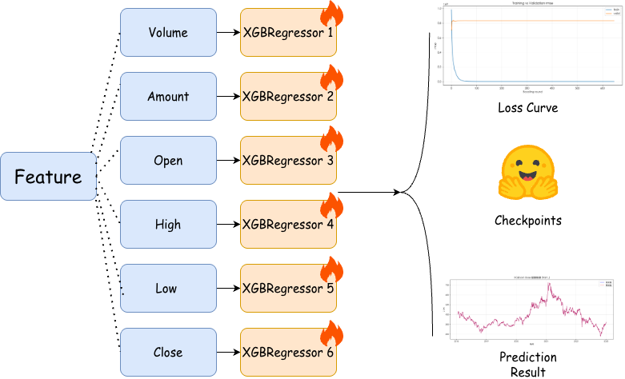

# Machine Learning: Quantitative Trading of a single stock with a small sample size

**The project web can be found [here]()**

This project is aimed at building a Machine Learning model to implement quantitative trading on the Tencent Stock based on ¥100000. Specifically , we build a model to satisfy the following requirements:

* Complete preprocessing of the provided data and mine relevant factors.
* Construct a machine learning model, build a training dataset, predict stock prices, and analyze the prediction effectiveness.
* Based on the stock prices predicted by machine learning, identify buying and selling opportunities, develop a trading strategy, and achieve index enhancement to capture excess returns (alpha).
* The strategy must aim to keep the maximum drawdown as low as possible.
* Create visualizations of the final investment results, evaluate the results against actual market data, and conduct a comprehensive assessment of the strategy's and model's overall effectiveness.

## FrameWork




## Quick Start

### Requirements Install


```shell
conda create -n mlhw python==3.12
conda activate mlhw
pip install requirements.txt
```

### Data Preprocessing and $\alpha$ Factor Mining

